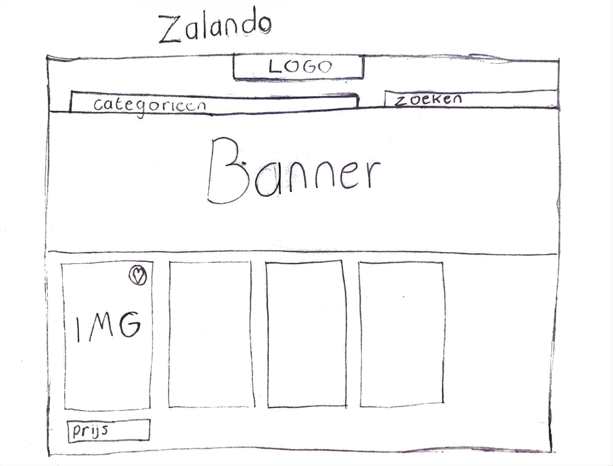

# Procesverslag
**Auteur:** Christiaan Zandbergen

Markdown cheat cheet: [Hulp bij het schrijven van Markdown](https://github.com/adam-p/markdown-here/wiki/Markdown-Cheatsheet). Nb. de standaardstructuur en de spartaanse opmaak zijn helemaal prima. Het gaat om de inhoud van je procesverslag. Besteedt de tijd voor pracht en praal aan je website.

## Bronnenlijst
1. -bron 1-
2. -bron 2-
3. -...-

## Eindgesprek (week 7/8)

-dit ging goed & dit was lastig-

**Screenshot(s):**

-screenshot(s) van je eindresultaat-

## Voortgang 3 (week 6)

-same as voortgang 1-

## Voortgang 2 (week 5)

-same as voortgang 1-

## Voortgang 1 (week 3)

### Stand van zaken

-dit ging goed & dit was lastig-

Eerst ben ik begonnen met de desktop versie. Nu ben ik veranderd van aanpak door eerst op mobiel te focussen en daarna pas responsive maken. Met de desktop versie had ik erg veel moeite om de lay-out goed in HTML te vertalen. Nu ik bezig ben met de mobiele site gaat alles veel beter en overzichtelijker.

**Screenshot(s):**

.png)
.png)
.png)

-screenshot(s) van hoe ver je bent-

### Agenda voor meeting

-samen met je groepje opstellen-

### Verslag van meeting

-na afloop snel uitkomsten vastleggen-

## Intake (week 1)

**Je startniveau:** Rood

**Je focus:** ik wil graag zo goed mogelijk de gehele site nabouwen met elke reponsive brake point.

**Je opdracht:** [Zalando website](https://www.zalando.nl/heren-home/)

**Screenshot(s):**

.png)
.png)
.png)

**Breakdown-schets(en):**

